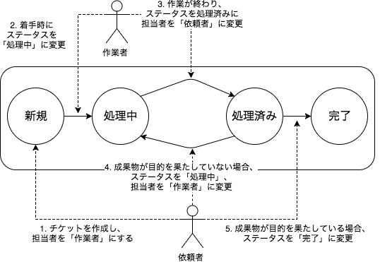

# チケットの作成から完了まで

* 新規
    * タスクが作られ、未着手
* 処理中
    * 担当者がアサインされ、作業中
* 処理済み
    * 担当者の作業が終わり、目的に至ったかの確認中
* 完了
    * 目的が果たされたことが確認され、タスクは終わった

「処理済み」 を 「完了」 にするのは、プロジェクトにおける検収と同様です。

なので、チケットを完了にするのはタスクを依頼した人となります。

# チケットを誰が作るのか

作業担当者のタスク習熟度に応じて変わります。
最初のうちは依頼者が作り、習熟してきたら作業担当者に作ってもらうようにします。

## 依頼者が作るケース

依頼者がチケットを作り、完了条件をチケットに明記します。

作業担当者が意識することは以下となります

* 着手時
    * チケットの状態を「処理中」にする
* 成果物ができたとき
    * チケットの状態を「処理済み」にする
    * チケットの担当者を「依頼者」にする

経験が浅い場合、完了条件の定義が困難のため、
まずはタスクの実施だけに専念してもらいます。

## 作業担当者が作るケース

依頼者がチケットを作っていると、どうしても

「依頼者のチケット作成スピードの限界」 = 「チームの作業スピードの限界」

になります。

なので、作業担当者がタスクに慣れてきたら、
依頼者が作業者にタスクを伝え、チケットは作業者が作ります。

