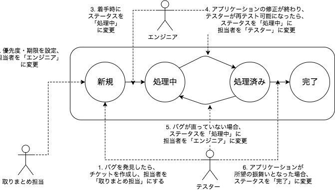

# バグチケットの作成から完了まで

## 役割分担

* テスター
    * テストを実施する人
* エンジニア
    * アプリケーションを修正する人
* 取りまとめ担当
    * バグの修正する優先度を設定する
    * どのエンジニアがバグの修正をするかを設定する

取りまとめ担当はリードエンジニアが担当することが多いです

## チケットのステータス

* 新規
    * バグが発見された
* 処理中
    * エンジニアがアサインされ、修正作業中
* 処理済み
    * 修正されたアプリケーションが準備でき、再テスト待ち
* 完了
    * バグが修正され、所望の振舞いとなった

## ワークフロー

